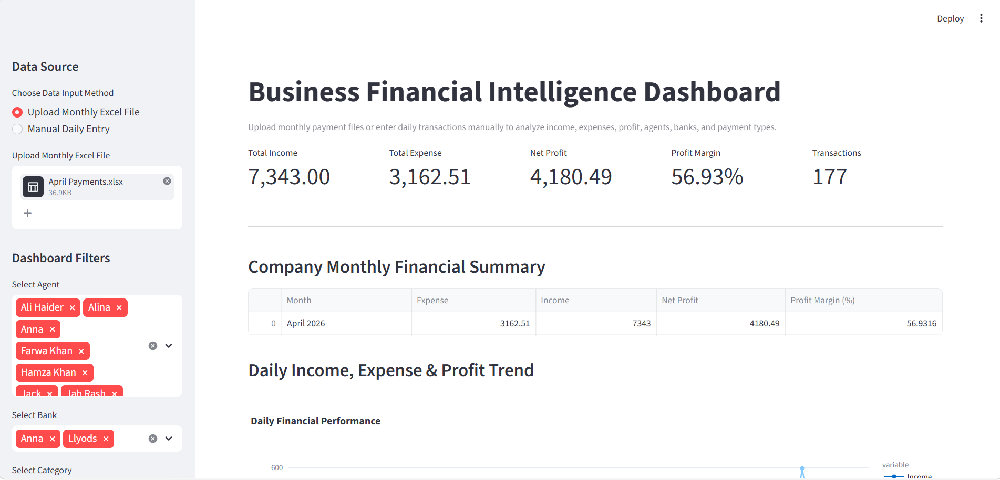
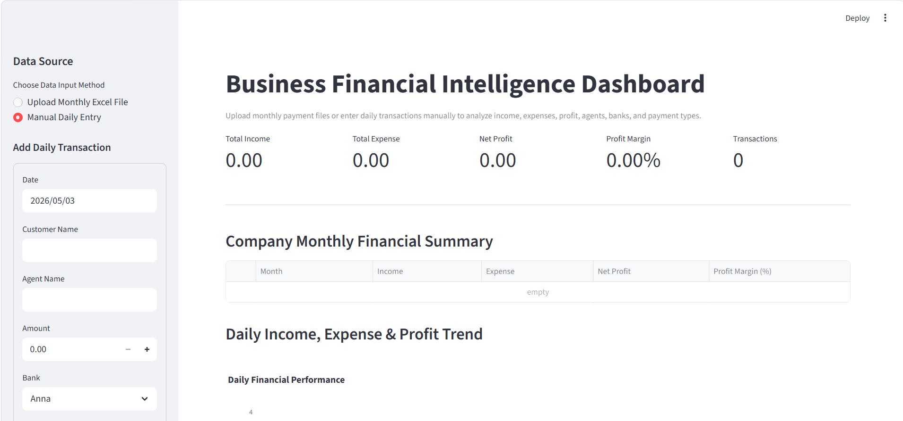

# 📊 Business Financial Intelligence Dashboard

An interactive financial analytics dashboard built with Python, Pandas, Plotly, and Streamlit.

## 🚀 Features

- Upload monthly Excel financial data
- Manual daily transaction entry
- Automatic income vs expense classification
- Real-time KPI tracking:
  - Total Income
  - Total Expense
  - Net Profit
  - Profit Margin
- Agent-wise performance analysis
- Daily & monthly financial trends
- Payment type breakdown
- Bank-wise insights
- Download filtered datasets

## 📈 Business Value

This dashboard enables organizations to:
- Monitor profitability and cost structure
- Identify top-performing agents
- Analyze revenue streams and expense drivers
- Track daily and monthly financial performance
- Support data-driven decision-making

## 🛠 Tech Stack

- Python
- Pandas
- Plotly
- Streamlit

## ▶️ Run Locally

```bash
pip install -r requirements.txt
streamlit run app.py
## 📸 Dashboard Preview




